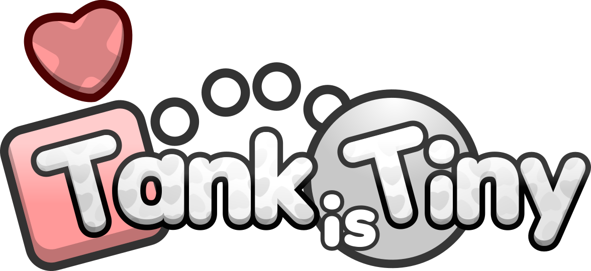

# Tank Is Tiny

An upcoming shooter-style game I made in JavaScript with the [p5.js library](https://github.com/processing/p5.js) (1.11.11).

This is my ongoing hobby project. Code is provided as-is with minimal documentation.

<!-- [Play the game here.](https://night-kolo.itch.io/tank-game) -->

### Features
- Multiple enemy types (Shooter, Bouncer, Splitter, etc.)
- Power-up system (Tank Buddy, Counter-Spike, Dazzle, Inaccuracy)
- Wave-based progression system
- Spatial audio for immersive sound
- Screen shake and visual feedback (juice)

## Libraries Used
- [**p5.js**](https://p5js.org/) - Graphics and game loop
- [**p5.touchgui**](https://github.com/L05/p5.touchgui) - UI elements
- [**Howler.js**](https://howlerjs.com/) - for Audio

